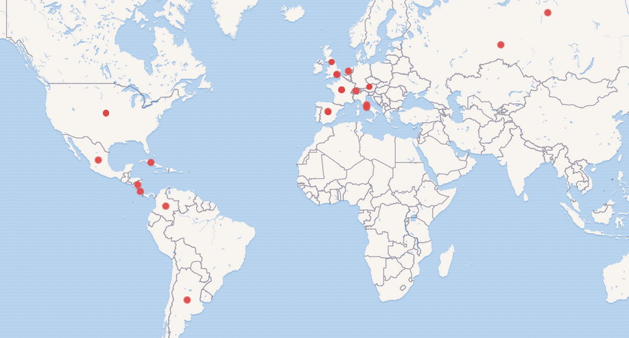

# Mnemosine-wikidata-queries
Ejemplos de consultas basadas en Wikidata para explorar los datos proporcionados por la biblioteca [Mnemosine](http://repositorios.fdi.ucm.es/mnemosine/).

### Lista de autores enlazados a Wikidata ([ver en Wikidata](https://w.wiki/APHu))

```
SELECT ?s ?sLabel ?nationalityLabel ?img 
WHERE { 
    ?s wdt:P31 ?type .
    ?s wdt:P27 ?nationality .
    ?s wdt:P10373 ?nemosine .
    OPTIONAL {?s wdt:P18 ?img .}   
    SERVICE wikibase:label { bd:serviceParam wikibase:language "[AUTO_LANGUAGE],en". }
}
LIMIT 100
```

### Comparación del género de los autores ([ver en Wikidata](https://w.wiki/APJ4))
```
#defaultView:BarChart
SELECT ?genero ?generoLabel (COUNT(?s) AS ?count)
WHERE
{
  ?s wdt:P10373 ?nemosine .
  ?s wdt:P21 ?genero
  SERVICE wikibase:label { bd:serviceParam wikibase:language "[AUTO_LANGUAGE],en". }
}
GROUP BY ?genero ?generoLabel
ORDER BY DESC(?count)
```

### Nacionalidades de los autores representado en un mapa ([ver en Wikidata](https://w.wiki/APHk))
```
#defaultView:Map
SELECT ?s ?sLabel ?nationalityLabel ?img ?coord
WHERE { 
    ?s wdt:P31 ?type .
    ?s wdt:P27 ?nationality .
    ?s wdt:P10373 ?nemosine .
    ?nationality wdt:P625 ?coord.
    OPTIONAL {?s wdt:P18 ?img .}   
    SERVICE wikibase:label { bd:serviceParam wikibase:language "[AUTO_LANGUAGE],en". }
}
LIMIT 100
```




### Consulta federada BVMC-Mnemosine, obras de la Biblioteca Virtual Miguel de Cervantes de los autores incluidos en Mnemosine ([ver en Wikidata](https://w.wiki/APJK))

```
SELECT ?sLabel ?s ?mnemosine ?bvmc ?workBvmc ?workTitle WHERE {
  ?s wdt:P10373 ?mnemosine .
  ?s wdt:P2799 ?bvmc .
  BIND(uri(concat("https://data.cervantesvirtual.com/person/", ?bvmc)) as ?bvmcID) 
  SERVICE <http://data.cervantesvirtual.com/openrdf-sesame/repositories/data> {
    ?bvmcID <http://rdaregistry.info/Elements/a/authorOf> ?workBvmc .
    ?workBvmc rdfs:label ?workTitle        
  }
  SERVICE wikibase:label { bd:serviceParam wikibase:language "[AUTO_LANGUAGE],en". }
}
LIMIT 100
```
